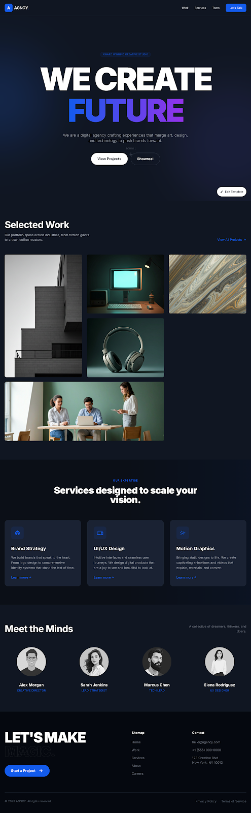
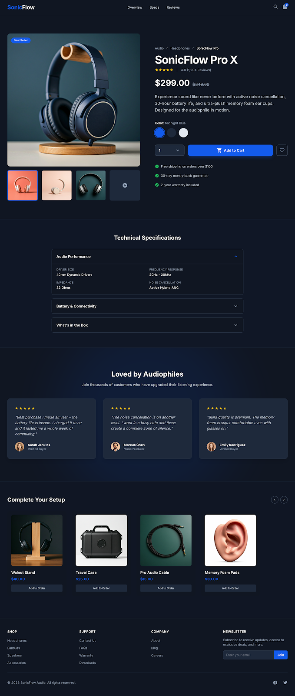
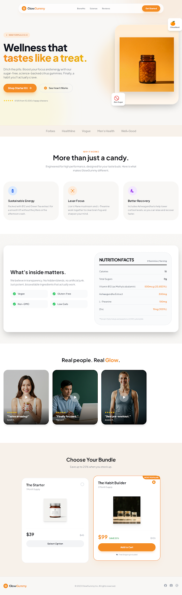
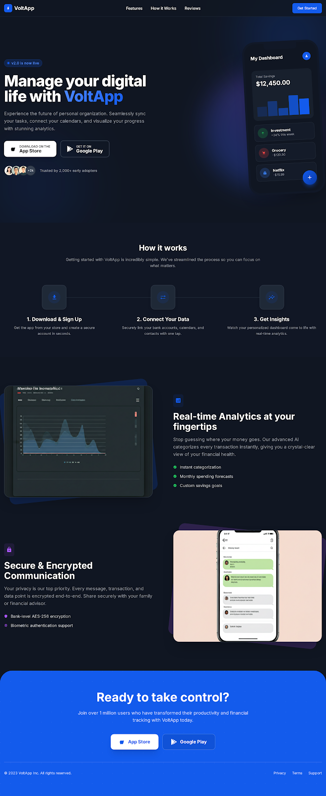
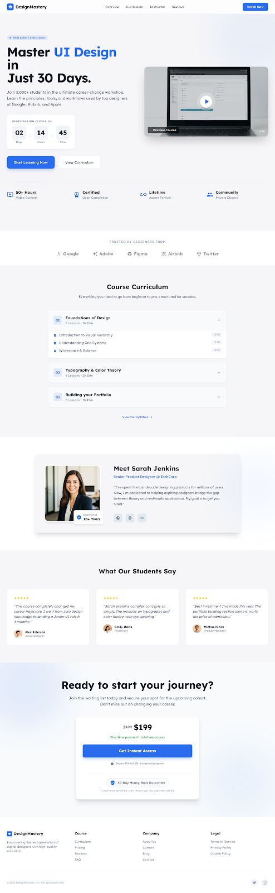
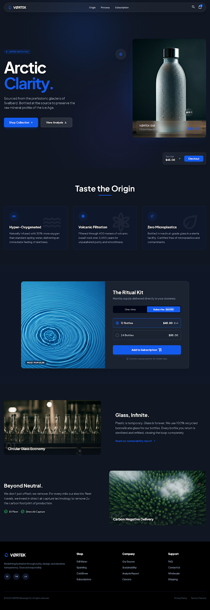
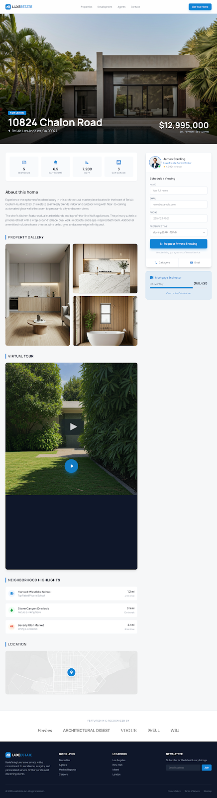
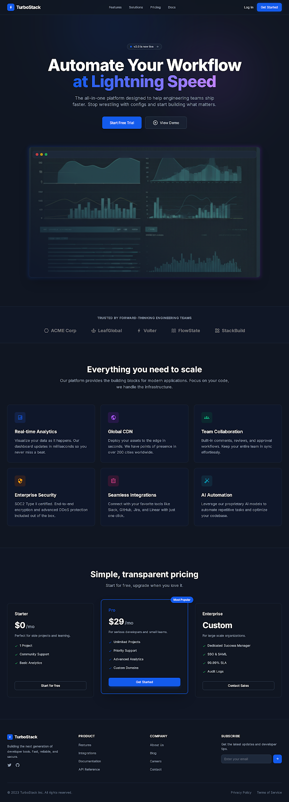

# Landing Page Generator

A powerful, flexible landing page generator built with React, TypeScript, and Vite. Create dynamic, data-driven landing pages using a declarative JSON-based approach that separates content from code.

## ✨ Features

- **🚀 Component-Based Architecture**: Compose landing pages from reusable React components
- **⚡ Declarative Actions**: Define user interactions with simple JSON configurations
- **🎨 Themeable Design System**: Customize visual styles through CSS custom properties
- **📱 Responsive Layouts**: Device-specific layouts for optimal mobile and desktop experiences
- **🔄 Dynamic Flows**: Create multi-step user journeys with conditional navigation
- **📊 A/B Testing Ready**: Easy variant creation and traffic splitting
- **⚙️ Action Dispatcher**: Centralized system for API calls, analytics, state management, and more
- **🔧 Extensible**: Add custom components and actions without touching core code

## 🎯 Advantages

- **⚡ Speed**: Rapid development and deployment of landing pages with minimal coding
- **🔧 Flexibility**: Easily adapt and customize pages for different campaigns and audiences
- **📦 Decomposition**: Clean separation of content, styling, and logic for maintainable code
- **👥 Team Collaboration**: JSON-based configurations make it easy for designers, marketers, and developers to work together
- **🔄 Reusability**: Reuse components and themes across multiple projects
- **📈 Scalability**: Handle complex user flows and integrations without performance issues
- **🧪 Testability**: Built-in A/B testing support for data-driven optimization
- **🚀 Performance**: Optimized rendering and loading for fast user experiences

## 🚀 Quick Start

### Prerequisites

- Node.js 18+
- npm or yarn

### Installation

```bash
git clone https://github.com/your-username/landing-page-generator.git
cd landing-page-generator
npm install
npm run dev
```

Visit `http://localhost:5173` to see your landing page.

## 📁 Project Structure

```
src/
├── components/          # Reusable React components
│   ├── sections/        # Page sections (Hero, Features, etc.)
│   └── forms/           # Form components
├── engine/              # Core orchestration
│   ├── ActionDispatcher.ts    # Action execution system
│   ├── LayoutResolver.tsx     # Device-specific layouts
│   ├── ProjectResolver.tsx    # JSON config loading
│   └── ThemeInjector.tsx      # CSS variable injection
├── landings/            # Landing page configurations
│   ├── _template/       # Boilerplate for new landings
│   └── my-landing/      # Your landing page
│       ├── theme.json   # Visual styling
│       ├── flow.json    # Navigation structure
│       └── steps/       # Page layouts
├── schemas/             # Zod validation schemas
└── registry/            # Component registration
```

## 🎯 Core Concepts

### Themes
Define visual styles (colors, fonts, spacing) in `theme.json`. Values become CSS custom properties automatically applied to components.

[Learn more about Themes →](docs/THEMES.md)

### Flows
Structure user journeys with `flow.json`. Define step sequences and navigation logic for multi-page experiences.

[Learn more about Flows →](docs/FLOWS.md)

### Layouts
Create page content with `desktop.json` and `mobile.json`. Compose sections from components with props and actions.

[Learn more about Layouts →](docs/LAYOUTS.md)

### Components
Use pre-built components like Hero, Navigation, Testimonials, and more. All components automatically receive theme variables and action dispatchers.

[Learn more about Components →](docs/COMPONENTS.md)

### Actions
Handle user interactions with the Action Dispatcher. Support for navigation, API calls, analytics, and complex workflows.

[Learn more about Actions →](docs/ACTION_DISPATCHER.md)

### A/B Testing
Create landing variants by duplicating configurations. Implement traffic splitting to compare performance and optimize conversions.

[Learn more about A/B Testing →](docs/AB_TESTING.md)

## 🛠️ Creating Your First Landing Page

1. **Copy the template:**
   ```bash
   cp -r src/landings/_template src/landings/my-awesome-landing
   ```

2. **Customize the theme:**
   ```json
   // src/landings/my-awesome-landing/theme.json
   {
     "colors": {
       "primary": "#your-brand-color"
     }
   }
   ```

3. **Define your flow:**
   ```json
   // src/landings/my-awesome-landing/flow.json
   {
     "steps": [
       { "id": "home" },
       { "id": "features" },
       { "id": "signup" }
     ]
   }
   ```

4. **Build your layouts:**
   ```json
   // src/landings/my-awesome-landing/steps/home/desktop.json
   {
     "sections": [
       {
         "component": "Hero",
         "props": {
           "title": "Welcome to My Product",
           "subtitle": "The best solution ever"
         }
       },
       {
         "component": "TwoColumnSection",
         "props": { 
           "title": "Why Choose Us",
           "content": "Check out our amazing features."
         },
         "actions": {
           "approve": {
             "type": "navigate",
             "url": "/features"
           }
         }
       }
     ]
   }
   ```

5. **View your landing:**
   Navigate to `http://localhost:5173/my-awesome-landing` in your browser.

## 🎨 Example Landing Pages

Explore our collection of pre-built landing page examples. Each includes a JSON config for easy customization.

- **Creative Agency Portfolio**  
    
  Showcase design work with project galleries and contact forms.  
  [View Config](src/landings/creative_agency_portfolio/)

- **E-commerce Product Page**  
    
  Sell products with pricing, features, and CTAs.  
  [View Config](src/landings/ecommerce_product_page/)

- **Event & Conference Landing**  
    
  Promote events with schedules and registration.  
  [View Config](src/landings/event_&_conference_landing_page/)

- **Gummy Supplements Landing**  
    
  Health product page with testimonials.  
  [View Config](src/landings/gummy_supplements_landing_page/)

- **Mobile App Showcase**  
    
  App marketing with screenshots and downloads.  
  [View Config](src/landings/mobile_app_showcase/)

- **Online Course Landing**  
    
  Educational content with curriculum and pricing.  
  [View Config](src/landings/online_course_landing_page/)

- **Premium Bottle Product**  
    
  Luxury product page for high-end items.  
  [View Config](src/landings/premium_bottle_product_page/)

- **Professional Services**  
    
  B2B services with team profiles.  
  [View Config](src/landings/professional_services_page/)

- **Real Estate Landing**  
    
  Property marketing with listings.  
  [View Config](src/landings/real_estate_landing_page/)

- **SaaS & Tech Landing**  
    
  Software promotion with features and demos.  
  [View Config](src/landings/saas_tech_landing_page/)

*Note: Preview images are placeholders. Add actual screenshots to the respective folders for visual examples.*

## 🔧 Development

### Available Scripts

```bash
npm run dev          # Start development server
npm run build        # Build for production
npm run preview      # Preview production build
npm run lint         # Run ESLint
```

### Adding Custom Components

1. Create your component in `src/components/`
2. Register it in `src/registry/ComponentMap.ts`
3. Use it in your layout JSON

### Extending Actions

1. Add schema validation in `src/schemas/actions.ts`
2. Create handler in `src/engine/actions/`
3. Register in `src/engine/ActionDispatcher.ts`

## 🤝 Contributing

We welcome contributions! Please see our contributing guidelines and code of conduct.

## 📄 License

This project is licensed under the Landing Page Generator License - see the LICENSE file for details.

**Key Terms:**
- ✅ Commercial use allowed with attribution
- 📝 Attribution required for all uses
- 🏢 Commercial users must display "Powered by Landing Page Generator"
- 🔗 Link to project repository required

The license permits commercial use but requires proper attribution and credit to the original project.

## 📚 Documentation

- [Action Dispatcher](docs/ACTION_DISPATCHER.md) - Complete guide to actions and workflows
- [Themes](docs/THEMES.md) - Visual styling and design system
- [Flows](docs/FLOWS.md) - Navigation and user journey management
- [Layouts](docs/LAYOUTS.md) - Page composition and responsive design
- [Components](docs/COMPONENTS.md) - Available components and customization
- [A/B Testing](docs/AB_TESTING.md) - Testing and optimization strategies

---

Built with ❤️ using React, TypeScript, and Vite.